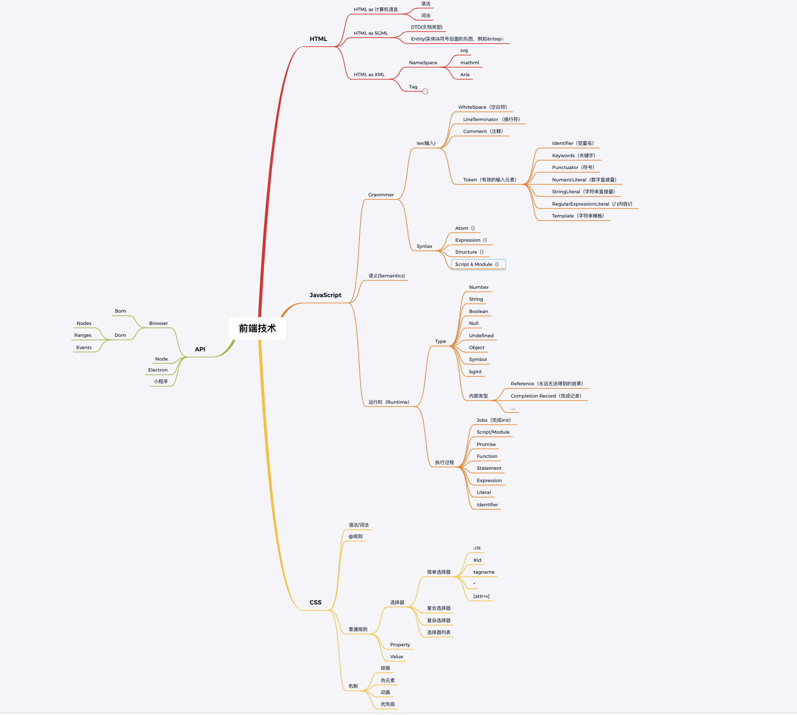

# 第一周总结

## 前端知识的脑图(待后续完善)

## 课程内容

### 优秀工程师具备的能力

- 领域知识

  - 将工作中涉及到的知识点串联起来形成一个知识面，最终成为一个领域，或者一个专业方向的专家

- 能力/潜力

  - 首先难以体现
  - 应该用过往的工作成绩，更多是过往的就职公司是否被业界认可，或者是产出过 star 数过千的开源项目，访问量过千的博客

- 职业规划(非常重要)

  - 只有自己才是职业发展的负责人
  - 只有自己才能清楚自己的能力
  - 给自己设定阶段目标和最终目标（比如：现阶段目标就是进大厂）

- 成就(客观概念)

  - 商业成就(面试的最有效的途径，获取高薪和进入大厂的最好方式)
  - 练习成就(最好融入公司的项目中实践成为商业成就)

### 职业发展(方法论)

- 业务性(**如何成为业务型人才**)

  - 业务目标
    - 理解和认可公司业务的核心价值
    - **目标转化 KPI 考核指标**
  - 技术方案
    - 业务指标到**技术指标的转化**
    - 形成纸面方案，完成**小规模试验**
  - 实施方案
    - 确定实施目标
    - 管理实施进度
  - 结果评估
    - **数据采集**，数据报表
    - 向上级**汇报**，并且是以数据形式回报
  - 案例
    - 应用手势: 通过手势操作切换 TAB 提升业务指标（**意外收获**）

- 技术难题(**少数人**)

  - 目标
    - 公认的技术难点
  - 方案与实施
    - 依靠扎实的编程能力，架构能力形成解决方案
  - 结果
    - 解决问题，形成方法论，并且可推广，可学习
  - 案例
    - 爬取 JD 商品价格: 通过 js 数字识别技术

- 工程型成就(**多数人**)
  - 目标
    - 保证质量，提升效率，多人协作开发效果更佳
  - 方案与实施
    - 规章制度
    - 库
    - 工具
    - 系统
  - 结果
    - 线上监控
  - 案例
    - xss 攻击的预防: 整理安全手册，review 代码，代码扫描工具

### 晋升

#### 数据驱动的思考方式

目标-> 现状 -> 方案 -> 实施 -> 结果

1. 目标
   - 基于现状，设定一定可实现的目标
   - 采集业务数据
   - 采集技术数据(加载时间，错误数据-window.onerror)
   - 建立数据展示系统
2. 方案
   1. 设计技术方案
   2. 需要有预估数据(方便和团队还有合作方沟通)
3. 实施
   - 小规模试验(不能一下子全上,最后发现全公司觉得不怎么好用)
   - 推广全公司落地形成制度
4. 结果
   - 统计最终效果汇报
     - 不汇报很多东西相当于没做
     - 上级如果不想听汇报(证明你做的目标定得不对)

### 前端技能模型

1. 领域知识
   - 使用追溯法和整理法把知识体系整理和归纳并且串联起来，例如使用 xmind 建立自己的思维导图
2. 前端知识
   - 需要自己掌握
3. 编程能力
   - 算法，刷 LeetCode
4. 架构能力
   - 组件化
5. 工程能力
   - 工具链
   - 持续集成

### 工具链

init -> run -> test -> publish

- 工具链的作用
- 工具的分类
  - 脚手架
  - 本地调试
  - 单元测试
  - 发布
- 工具链体系的设计
  - 版本问题
  - 数据设计

### 持续集成

- 客户端软件持续集成
  - Daily build
  - BVT
- 前端持续集成
  - Check-in build
  - LInt + Rule Check

### 技术架构

- 客户端架构: 解决软件需求规模带来的复杂性
- 服务端架构：解决大量用户访问带来的复杂性
- 前端架构：解决大量页面需求带来的重复劳动问题(**高度抽象，复用性**)

### 个人总结

#### 不足

- 基础知识不扎实，太泛，不接地气，很多地方都需要去搜索
- 工作中业务场景过于简单，没有使用到技术的核心，对核心掌握程度不够深
- 没有点到面的知识体系，都是用砖填坑
- 算法薄弱
